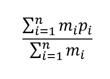

# Projecto de Recurso 2023

**UNIVERSIDADE LUSÓFONA DE HUMANIDADES E TECNOLOGIAS**

*Linguagens de Programação I*

# Projecto de Recurso 2023 - PORT MANAGER
>Na resolução deste projecto deve ser utilizada a Linguagem de Programação C. Para além da correta implementação dos requisitos, tenha em conta os seguintes aspetos:
>- O código apresentado deve ser bem indentado. 
>- O código deve compilar sem erros ou *warnings* utilizando o *gcc* com as seguintes flags:
>- `-g -Wvla -Wall -Wpedantic -Wextra -Wdeclaration-after-statement`
>- Tenha em atenção os nomes dados das variáveis, para que sejam indicadores daquilo que as mesmas vão conter.
>- Não é permitida a utilização de variáveis globais ou estáticas
>- O programa não deve ter *memory leaks*.
>- O trabalho deve ser desenvolvido e submetido de forma individual.

>Este exercício deverá ser submetido na plataforma Pandora até às 23h59 de dia 14 de Julho e será contabilizado para a nota final da unidade curricular de acordo com os critérios disponibilizados na página da disciplina, concretamente nos slides da primeira aula.

>Todos os trabalhos serão comparados utilizando um sistema de deteção de plágio.


# Descrição do problema

Neste exercício vamos desenvolver um simulador de um estaleiro de embarcações de carga. 
- Neste estaleiro podem atracar até 10 embarcações. Os lugares para atracagem estão identificados de 0 a 9. 
- Cada embarcação é inequivocamente identificada por uma matrícula composta por 4 letras maiúsculas (os caracteres permitidos são de A a Z, exemplo ALBA). 
- Cada embarcação pode conter até 6 pilhas de contentores, identificadas pelos números de 0 a 5. 
- Cada contentor é identificado por um código único composto por 4 letras e 2 número (exemplo AABB77).

- Cada contentor tem também associado um peso, em kg. O peso dos contentores tem de ser sempre igual ou superior a 500kg.
- Cada contentor tem ainda associada uma lista com os produtos transportados nesse contentor. Esta lista pode conter um número arbitrário de elementos.

- Existem duas gruas identificadas pelas letras A e B, que servem para mover contentores entre pilhas. As gruas têm comportamentos ligeiramente diferentes, contudo ambas transportam contentores que estão numa determinada pilha de uma embarcação para outra pilha que poderá estar na mesma embarcação, noutra embarcação.

- Não há limite para o número de contentores que uma pilha pode suportar.

A título de exemplo suponha que a embarcação `LENA` está atracada no ponto de atracagem `5`. Esta embarcação tem 3 pilhas de contentores. A pilha 0 tem os contentores AAAA00 BBBB00 CCCC00, a pilha 1 tem os contentores DDDD00 EEEE00 e a pilha P2 tem os contentores FFFF00, como se pode ver na seguinte imagem:


Qualquer uma das gruas pode, por exemplo, mover 1 contentor da pilha 1 para a pilha 2 e neste caso será sempre retirado o contentor que está no topo da pilha, ou seja o EEEE00.  A grua B pode também mover 2 contentores da pilha 0 para a pilha 1, e neste caso serão movidos os contentores CCCC00 e BBBB00.

A diferença de funcionamento das duas gruas prende-se com a ordem pela qual os contentores são movidos. A grua A apenas consegue mover um contentor de cada vez, pegando sempre no contentor que está no topo. A grua B consegue mover até 4 contentores de uma só vez, preservando a ordem original desse grupo de contentores. Suponhamos que partimos da configuração original do exemplo:
```
  CCCC00
  BBBB00   EEEE00
  AAAA00   DDDD00   FFFF00
|--------|--------|--------|
   0      1     2
5: LENA
```

Se a grua A for ordenada a mover 2 contentores da pilha 0 para a pilha 2, ele teria de fazer dois movimentos onde no fim da operação, a pilha 2 terá os contentores BBBB00, CCCC00 e FFFF00:
```
           BBBB00
  EEEE00   CCCC00
  AAAA00   DDDD00   FFFF00
|--------|--------|--------|
   0      1      2
```
Por outro lado se o mesmo comando for dado à grua B, a pilha 2 ficaria com os contentores CCCC00, BBBB00, FFFF00:
```
           CCCC00
  EEEE00   BBBB00
  AAAA00   DDDD00   FFFF00
|--------|--------|--------|
   0     1       2 
```

A grua B move sempre o máximo de contentores possível de cada vez. Caso haja uma ordem para mover um número superior a 4, a grua terá de fazer mais do que um movimento.

## Execução do programa
O programa pode aceitar um parâmetro (opcional) na linha de comandos que indica o nome do ficheiro de configuração que deverá ser lido pelo simulador. Por exemplo:
```
./porto ficheiro_porto_lisboa.txt
```
Caso o ficheiro não exista, o simulador deve terminar após apresentar a mensagem 
```ERROR: could not open file```

Caso o ficheiro não respeite o formato esperado, o programa deve terminar após apresentar a mensagem 
```ERROR: file format is not recognized```

Após a leitura do ficheiro de configuração, o simulador deve apresentar um menu (ver secção Menu Principal) e começar a aceitar comandos do utilizador.

Caso o ficheiro não seja passado pelo utilizador, o programa deve arrancar normalmente sem embarcações e todos os pontos de atracagem vazios.

## Leitura do ficheiro de configuração

O simulador começa por verificar se o utilizador passou como parâmetro o nome de um ficheiro de input. Em caso afirmativo, o programa deverá ler de um ficheiro a configuração do porto. O ficheiro organiza-se da seguinte forma:
```
d<ponto de atracagem> <matricula>
	p0 <numero de contentores da pilha 0> <contentor 0 da pilha 0:peso> <contentor 1 pilha 0:peso> <contentor 2 pilha 2:peso>...
	p1 <numero de contentores da pilha 1> <contentor 0 da pilha 1:peso> <contentor 1 pilha 1:peso> <contentor 2 pilha 1:peso>...
	p2 <numero de contentores da pilha 2> <contentor 0 da pilha 1:peso> <contentor 1 pilha 1:peso> <contentor 2 pilha 1:peso>...
	p3 <numero de contentores da pilha 3> <contentor 0 da pilha 1:peso> <contentor 1 pilha 1:peso> <contentor 2 pilha 1:peso>...
	p4 <numero de contentores da pilha 4> <contentor 0 da pilha 1:peso> <contentor 1 pilha 1:peso> <contentor 2 pilha 1:peso>...
	p5 <numero de contentores da pilha 5> <contentor 0 da pilha 1:peso> <contentor 1 pilha 1:peso> <contentor 2 pilha 1:peso>...

c <numero de um contentor já inserido>:
	<produto 0 dentro do contentor>
	<produto 1 dentro do contentor>
	<produto 2 dentro do contentor>
	...
	;
...
```
O ficheiro contém apenas informação relativa a pontos de atracagem que estão ocupados por embarcações, assim como contém apenas informação sobre as pilhas que têm contentores. Pontos de embarcação que não estejam no ficheiro estão, por defeito livres. Assim como, pilhas que não têm contentores são consideradas vazias. 

Exemplo:
```
d5 LENA
	p0 3 AAAA00:1000 BBBB00:2000 CCCC00:1500
	p1 2 DDDD00:800 EEEE00:600
	p2 1 FFFF00:750

c AAAA00:
	lamps
	chairs
	tables
	couches
	;
```
Neste exemplo a embarcação LENA encontra-se atracada no porto 5 e contém as pilhas 0 1 e 2 ocupadas com contentores. As restantes pilhas desta embarcação estão vazias (livres) e poderão vir a ter contentores colocados por uma das gruas. Os restantes pontos de atracagem estão livres. Adicionalmente, o contentor com o identificador `AAAA00` tem a seguinte lista de bens: lapms, chair, tables and couches. Todos os contentores que não têm uma entreda começada por `c` com a sua lista de bens, estão vazios. A lista de bens em cada contentor termina sempre com o caracter `;`, que está numa linha sem nenhum bem.

Tanto os pontos de atracagem, como as pilhas, não necessitam de estar por ordem. No entanto, os contentores estão representados por ordem. No ficheiro da esquerda para a direita, representa os contentores que estão na pilha de baixo para cima. Um outro ficheiro válido que produziria o mesmo resultado do exemplo anterior seria:
```
d5 LENA
	p2 1 FFFF00:750
	p5 0
	p1 2 DDDD00:800 EEEE00:600
	p3 0
	p0 3 AAAA00:1000 BBBB00:2000 CCCC00:1500
```
Neste caso, as pilhas não aparecem por ordem. Além disso há duas pilhas, 5 e 3 que estão explicitamente vazias. A pilha 4 também está vazia (implícitamente).

Considere também o ficheiro [configfile1](./input1.txt) como exemplo.


## Menu principal

O programa deverá aceitar comandos introduzidos pelo utilizador, de acordo com o seguinte menu:

```
+---- MENU
| move		[-g grua] [-d ponto] [-p pilha] [-D ponto] [-P pilha] [-n numero_de_contentores]
| show		[-d ponto] [-e embarc]
| where		[embarc]
| navigate	[-e embarc] [-d ponto]
| load		[-e embarc] [-p pilha] [-c contentor:peso]
| weight	[embarc]
| balance   [embarc]
| search    [contentor]
| goods     [contentor]
| save		[filename]
| help
| quit
+----
```

Sempre que o programa estiver à espera de um input vindo do utilizador, deve apresentar o indicador no terminal:
```
>
```

Em seguida detalha-se o funcionamento de cada comando.

## Comando `move`
Este comando é dirigido à grua (A ou B), onde é indicado o ponto de atracagem de origem ou a embarcação de origem, o ponto de atracagem de destino ou a embarcação de destino e o número de contentores. 

Por exemplo, se quisermos que a grua A mova 2 contentores da pilha 0 do ponto de atracagem 1 para a pilha 1 do mesmo ponto de atracagem, podemos usar o seguinte comando:
```
move -g A -d 1 -p 0 -D 1 -P 1 -n 2
```
ou o comando:
```
move -d 1  -D 1 -P 1  -n 2 -p 0 -g A 
```

Se quisermos que a grua B mova 5 contentores da pilha 5 do ponto de atracagem 2 para a pilha 2 do ponto de atracagem 3 podemos usar o seguinte comando:
```
move -g B -P 2 -n 5 -p 5 -g B -d 2  -D 3  
```
Como se pode verificar no exemplo anterior, a ordem pela qual surgem os argumentos no comando é indiferente, no entanto todos os argumentos são obrigatórios.

Para executar o comando `move`, o programa começa por validar os inputs. Caso algum dos argumentos do comando não seja válido, o programa deve apresentar a mensagem: `ERROR: invalid command` e voltar a apresentar o menu principal.

Se todos os argumentos forem válidos, o comando deve ser executado, e os contentores devem ser movimentados de acordo com as regras de cada uma das gruas. Após a operação concluida deve ser apresentada a mensagem: `SUCCESS: operation concluded`. 

Caso o ponto de origem, ou ponto de destino não contenham embarcações ou não existam, o comando é considerado inválido.

Caso seja pedido para mover um número maior de contentores do que o número de contentores existentes na pilha, o comando é válido. Nesse caso são movidos todos os contentores dessa pilha, ficando sem contentores.


## Comando `show`
Este comando indica o número contentores presentes em todas pilhas numa embarcação. O comando pode ser introduzido sem argumentos, especificando o ponto de atracagem, ou especificando o identificador da embarcação. O output apresentado deverá respeitar o seguinte formato:
```
d<ponto> <embarcação>
	p<0> <numero de contentores da pilha 0> <contentor>:<peso> <contentor>:<peso> ...
	p<1> <numero de contentores da pilha 1> <contentor>:<peso> <contentor>:<peso> ...
	p<2> <numero de contentores da pilha 2> <contentor>:<peso> <contentor>:<peso> ...
	...
```
Por exemplo, o comando
```
show -d 5
```
apresenta a informação sobre a embarcação que está no ponto de atracagem 5. O output deverá ser:
```
d5 LENA
	p0 3 AAAA00:750 BBBB00:500 CCCC00:1000
	p1 2 DDDD00:2222 EEEE00:500
	p2 1 FFFF00:555
```

O comando:
```
show -e LENA
```
irá produzir o mesmo resultado do comando anterior.

O comando
```
show
```
apresenta a informação sobre todos os pontos de atracagem que estão ocupados começando no 0 e terminando no 9 (inclusive). Em baixo segue exemplo chamando só o show, onde no porto só existem as embarcações LENA e TOOR.

```
d5 LENA
	p0 3 AAAA00:750 BBBB00:500 CCCC00:1000
	p1 2 DDDD00:2222 EEEE00:500
	p2 1 FFFF00:555
d6 TOOR
	p1 1 AAAA00:1000 
	p2 2 BBBB00:10000 CCCC00:800
```

## Comando `where`

Este comando recebe o identificador de uma embarcação e apresenta o número do ponto de atracagem seguido do indentificador da embarcação. Por exemplo o comando:
```
where LENA
```
irá produzir o seguinte resultado:
```
5 LENA
```

Caso o id da embarcação fornecido não exista, a seguinte mensagem deverá ser apresentada:
```
ERROR: invalid command
```

## Comando `navigate`


O comando navigate permite mudar uma embarcação de um ponto de atracagem para outro. Para esse fim é necessário fornecer o id da embarcação e o ponto de atracagem destino. 

Em caso de sucesso o programa deverá apresentar a mensagem: `SUCCESS: operation concluded`, em caso de falha (por exemplo, se o ponto de destino estiver ocupado com outra embarcação), deverá apresentar a mensagem `ERROR: invalid command`.

Caso o identificador da embarcação não exista no porto de significa que se trata de uma embarcação nova que acaba de chegar. Nesse caso, deverá ser criada uma embarcação nova, sem contentores, e deverá ser colocada no ponto de atracagem indicado. Exemplo:

```
navigate -e TOOR -d 8 
```

Se TOOR não existe no porto, irá criar uma nova embarcação com o identificador `TOOR`, no ponto de atracagem 8.

Se TOOR existisse no porto de atracagem X, iria mudar TOOR do porto de atracagem X para o porto de atracagem 8.

## Comado `load`

Este comando serve para criar um contentor novo numa embarcação. . Contudo, este comando permite criar apenas um contentor de cada vez. O contentor será sempre colocado no topo da pilha. 

Por exemplo, se quisermos criar na embarcação TOOR um contentor na pilha 1 nomeado FF3 com peso de 750kg, seria dado o seguinte comando:
```
load -e TOOR -p 1 -c FFFF33:750
```


Em caso de sucesso o programa deverá apresentar a mensagem: `SUCCESS: operation concluded`, em caso de falha (por exemplo, se a informação do contentor não estiver correcta, ou caso já exista um contentor com o mesmo identificador), deverá apresentar a mensagem `ERROR: invalid command`.


## Comando `weight`

Este comando apresenta o peso total de uma embarcação. Por exemplo, o comando:
```
weight LENA
```
produz a seguinte mensagem se a embarcação conter um total de contentores perfazendo 6650kg:
```
LENA 6650
```
Em caso de falha (por exemplo, se a embarcação não for encontrada), deverá apresentar a mensagem `ERROR: invalid command`.

## Comando `search`

Este comando permite procurar em que embarcação está um determinado contentor. Por exemplo,

```
search AAAA00
```
 Deverá ter como resultado:

 ```
 AAAA00 at LENA p0 0
 ```

 Caso o contentor procurado não seja encontrado deverá ser apresentada a seguinte mensagem: `ERROR: Container not found`

 Em que p0 é a pilha do barco em que está o contentor e 0 é o nível, ou seja, a posição vertical do contentor deve ser contada a partir da base do barco.

## Comando `balance`

Este comando permite saber se o barco está em equilíbrio tendo em conta a distribuição de peso na embarcação. No caso de uma embarcação ter um número ímpar de contentores o centro considera-se a posição da pilha do meio; caso o número de contentores seja par então considera-se que está entre as duas pilhas do centro.
O equilibrio é calculado com a seguinte formula:



Em que mi é o peso de um contentores e pi é a posição desse contentor no barco. Todas as pilhas são equidistantes pelo que as posições tomam valores discretos, sendo sugerido usar o próprio número da pilha.


Por exemplo, se considerarmos o barco com 4 pilhas e os contentores representados na figura a cima, vemos que o barco tem 4 pilhas numeradas de 0 a 3. Neste caso em particular o barco considera-se em equilíbrio se o seu centro de massa estiver na posição entre a pilha 1 e 2, ou seja 1.5 com uma tolerância de 0.5.

Adicionalmente se considerarmos as seguintes cargas nos contentores:

```
d1 LENA
        p0 3 AAAA00:500 BBBB00:500 CCCC00:500 
        p1 0 
		p2 1 DDDD00:3500 
        p3 0 

```

Podemos verificar que a carga tem o seu centro na posição 1.4, estando o barco, por isso, capaz de navegar em segurança.


No caso de o barco estar equilibrado deve ser apresentada no terminal a seguinte mensagem: `SUCCESS: The Boat is balanced`; caso contrário deverá ser apresentada a mensagem: `ERROR: The Boat is Unbalanced`.

## Comando `goods`

Este comando permite obter a lista de material dentro de um contentor e a sua localização. Por exemplo,

```
goods AAAA00
```

Deverá ter como resultado:

 ```
AAAA00 at LENA p0 0
	T-shirts
	Sweaters
	Trousers
 ```

 Em que p0 é a pilha do barco em que está o contentor e 0 é o nível, ou seja, a posição vertical do contentor deve ser contada a partir da base do barco. A lista de bens é assim uma lista de strings contendo a descrição desses bens, não necessariamente apenas uma palavra.

Caso o contentor procurado não seja encontrado deverá ser apresentada a seguinte mensagem: `ERROR: Container not found`
Caso o contentor não contenha bens, deverá ser mostrada a localização do contentor, mas com a mensagem `EMPTY`, por exemplo:

```
BBBB00 at LENA p0 1
	EMPTY
```
## Comando `help`

Com este comando o menu deverá ser apresentado no terminal.


## Comando `save`

Com este comando o utilizador guarda num ficheiro a configuração atualizada do porto.
Ficheiro deve cumprir o formato definido na secção "Leitura do ficheiro de configuração". De modo a numa nova execução do programa seja possivel ler como um ficheiro novo de configuração.

No exemplo seguinte guarda a informacao de configuracao no ficheiro config.txt:
```
save config.txt
```
Em caso de sucesso deve apresentar a mensagem: `SUCCESS: operation concluded`


## Comando `quit`

Termina a execução do simulador.

## Conselhos de Implementação
- Comece por definir as estruturas para as embarcacoes, pontos de atracagem e contentores. 
- Escreva funções atómicas para validar os identificadores das embarcações, pontos de atracagem e contentores.
- Desenvolva a opção `quit`.
- Desenvolva a opção `navigate`.
- Desenvolva a opção `where`.
- Desenvolva a opcao `load`.
- Desenvolva a opcao `show`.
- Desenvolva o resto das opções.

A avaliação do pandora não irá avaliar todas as opções em todos os testes, ou seja, se apenas implementar algumas opções, certamente já terá uma parte da nota. Tenha em consideração que as opções `quit`, `navigate`, `where`, `load`, `show`, `balance`, `search` e `goods` são obrigatórias. Sempre que desenvolver uma opção nova, submeta o projecto no Pandora.


## Exemplos
```bash
% ./portmanager
+---- MENU
| move          [-g grua] [-d ponto] [-p pilha] [-D ponto] [-P pilha] [-n numero_de_contentores]
| show          [-d ponto] [-e embarc]
| where         [embarc]
| navigate      [-e embarc] [-d ponto]
| load          [-e embarc] [-p pilha] [-c contentor:peso]
| weight        [embarc]
| balance   	[embarc]
| search    [contentor]
| goods     	[contentor]
| save          [filename]
| help 
| quit 
+----
>navigate -e LENA -d 1
SUCCESS: operation concluded
>navigate -e XPTO -d 0
SUCCESS: operation concluded
>load -e LENA -p 0 -c AAAA00:500
SUCCESS: operation concluded
>load -e LENA -p 0 -c AAAA00:500
ERROR: invalid command
>show LENA
ERROR: invalid command
>show -e LENA
d1 LENA
        p0 1 AAAA00:500 

>load -e LENA -p 0 -c AAAA11:500
SUCCESS: operation concluded
>load -e LENA -p 0 -c AAAA22:500
SUCCESS: operation concluded
>load -e LENA -p 0 -c AAAA33:500
SUCCESS: operation concluded
>load -e LENA -p 0 -c AAAA44:500
SUCCESS: operation concluded
>load -e LENA -p 0 -c AAAA11:500
ERROR: invalid command
>load -e LENA -p 0 -c AAAA66:500
SUCCESS: operation concluded
>load -e LENA -p 0 -c AAAA77:500
SUCCESS: operation concluded
>load -e LENA -p 0 -c AAAA88:500
SUCCESS: operation concluded
>load -e LENA -p 0 -c AAAA99:500
SUCCESS: operation concluded
>load -e LENA -p 0 -c AABB00:500
SUCCESS: operation concluded
>load -e LENA -p 0 -c AABB11:500
SUCCESS: operation concluded
>load -e LENA -p 0 -c AABB22:500
SUCCESS: operation concluded
>load -e LENA -p 0 -c AABB33:500
SUCCESS: operation concluded
>load -e LENA -p 0 -c AABB44:500
SUCCESS: operation concluded
>load -e LENA -p 0 -c AABB11:500
ERROR: invalid command
>load -e LENA -p 0 -c AABB66:500
SUCCESS: operation concluded
>load -e LENA -p 0 -c AABB77:500
SUCCESS: operation concluded
>load -e LENA -p 0 -c AABB88:500
SUCCESS: operation concluded
>load -e LENA -p 0 -c AABB99:500
SUCCESS: operation concluded
>show -e LENA
d1 LENA
        p0 18 AAAA00:500 AAAA11:500 AAAA22:500 AAAA33:500 AAAA44:500 AAAA66:500 AAAA77:500 AAAA88:500 AAAA99:500 AABB00:500 AABB11:500 AABB22:500 AABB33:500 AABB44:500 AABB66:500 AABB77:500 AABB88:500 AABB99:500 

>weight LENA
LENA 9000
>where LENA
d1 LENA
>move -g A -d 1 -p 0 -D 1 -P 1 -n 5
SUCCESS: operation concluded
>show -e LENA
d1 LENA
        p0 13 AAAA00:500 AAAA11:500 AAAA22:500 AAAA33:500 AAAA44:500 AAAA66:500 AAAA77:500 AAAA88:500 AAAA99:500 AABB00:500 AABB11:500 AABB22:500 AABB33:500 
        p1 5 AABB99:500 AABB88:500 AABB77:500 AABB66:500 AABB44:500 

>move -g B -d 1 -p 0 -D 1 -P 2 -n 6
SUCCESS: operation concluded
>show -e LENA
d1 LENA
        p0 7 AAAA00:500 AAAA11:500 AAAA22:500 AAAA33:500 AAAA44:500 AAAA66:500 AAAA77:500 
        p1 5 AABB99:500 AABB88:500 AABB77:500 AABB66:500 AABB44:500 
        p2 6 AABB00:500 AABB11:500 AABB22:500 AABB33:500 AAAA88:500 AAAA99:500 

>
```

# Honestidade Académica

Nesta disciplina, espera-se que cada aluno siga os mais altos padrões de honestidade académica. Trabalhos que sejam identificados como cópias serão anulados e os alunos envolvidos terão nota zero - quer tenham copiado, quer tenham deixado copiar.
Para evitar situações deste género, recomendamos aos alunos que nunca partilhem ou mostrem o seu código.
A decisão sobre se um trabalho é uma cópia cabe exclusivamente aos docentes da unidade curricular.
Os alunos são encorajados a discutir os problemas com outros alunos mas não deverão, no entanto, copiar códigos, documentação e relatórios de outros alunos. Em nenhuma circunstância deverão partilhar os seus próprios códigos, documentação e relatórios. De facto, não devem sequer deixar códigos, documentação e relatórios em computadores de uso partilhado.


